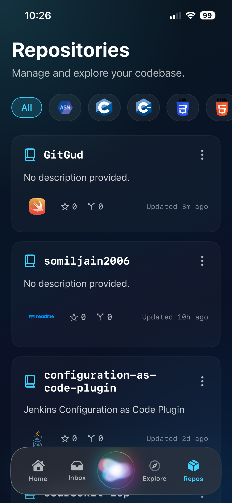
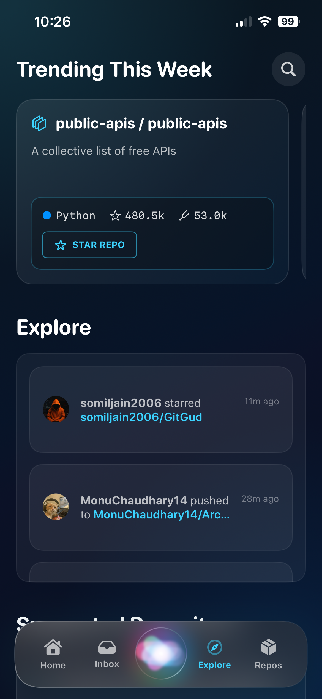
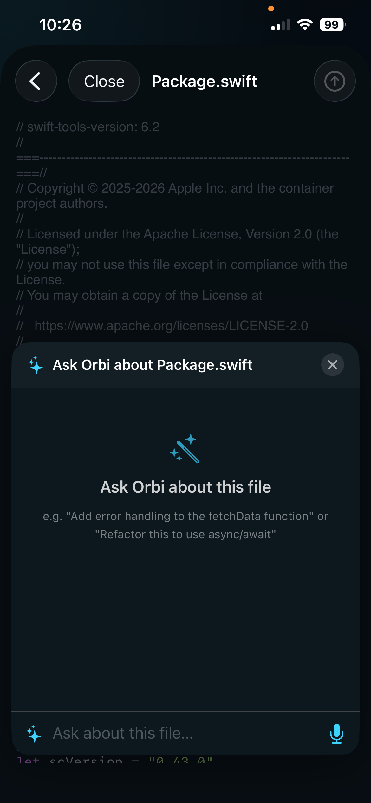
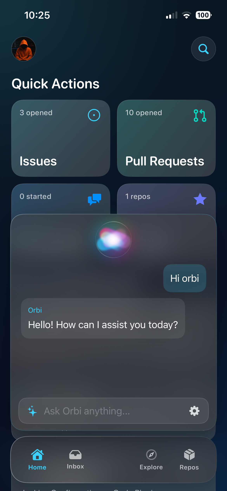
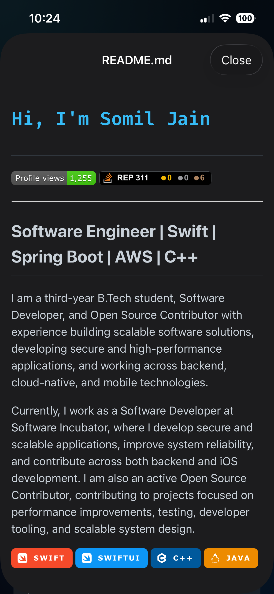
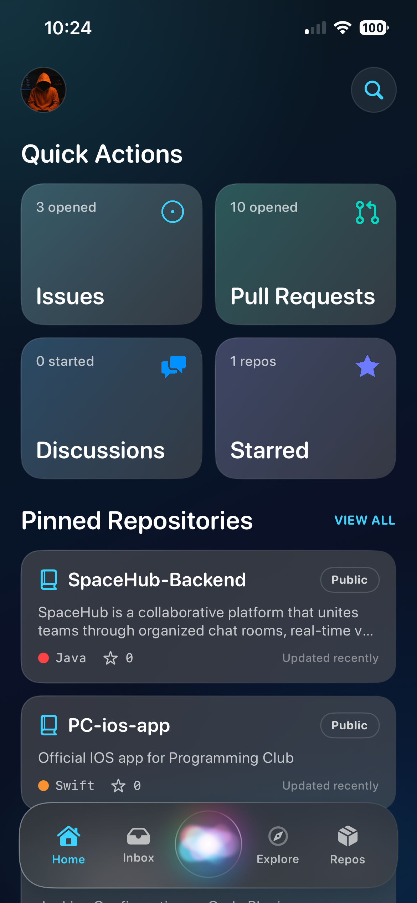

# GitGud - iOS App

A comprehensive iOS application built with SwiftUI for developers and open-source enthusiasts. It serves as a unified hub for the GitHub community to track repositories, manage issues and pull requests, explore new projects, and stay updated on notifications.

## Features

### Authentication & Profiles
- **Secure Access**: Integrated with GitHub OAuth/Tokens for robust authentication.
- **Session Management**: Secure storage and session recovery using `SessionStore`.
- **User Profiles**: Manage personal information and track your open-source presence.

### Integrated Platforms
- GitHub

### Home & Dashboard
- **Home Feed**: An interactive dashboard featuring your repositories, recent activities, and key metrics.
- **Repositories & Explore**: Discover trending projects, star repositories, and explore the open-source community.
- **Inbox & Notifications**: Real-time notification tracking to handle all your GitHub alerts gracefully.

### Collaboration & Management
- **Issues**: Track, read, and manage repository issues.
- **Pull Requests**: Review and manage pull requests on the go.
- **Orbi (AI Assistant)**: A futuristic, intelligent voice assistant and AI search panel to help users with repository navigation, code queries, and GitHub tasks.

## Design
- **Theme**: Dark and vibrant aesthetics for a modern, developer-focused look.
- **Animations**: Smooth transitions, spring-based swipe gestures, and engaging splash screen animations.
- **UI Components**: Custom bottom navigation bar (Dock), dynamic loading skeletons, and interactive cards for a premium user experience.

## Screenshots

<table>
  <tr>
    <td></td>
    <td></td>
    <td></td>
  </tr>
  <tr>
    <td></td>
    <td></td>
    <td></td>
  </tr>
</table>

## Project Structure
```text
GitGud/
├── GitMate/
│   ├── App/
│   │   ├── GitGudApp.swift           # Application entry point and state initialization
│   │   ├── ContentView.swift         # Main routing and root views
│   │   └── SessionStore.swift        # Authentication state management
│   ├── Core/
│   │   ├── Networking/               # API clients and network requests
│   │   ├── Models/                   # App-wide data models
│   │   ├── Components/               # Reusable core UI components
│   │   └── Extensions/               # Swift extensions and utilities
│   ├── Features/
│   │   ├── Authentication/           # Login and session management
│   │   ├── Home/                     # Dashboard and activity feeds
│   │   ├── Repositories/             # Repo management and browsing
│   │   ├── Issues/                   # Issue tracking and reading
│   │   ├── PullRequests/             # PR reviews and tracking
│   │   ├── Explore/                  # Trending repositories and discovery
│   │   ├── Inbox/                    # Notifications and alerts
│   │   ├── Profile/                  # User account and preferences
│   │   └── Orbi/                     # AI voice assistant and search interface
│   └── Shared/                       # Shared utilities and resources
```

## Backend Configuration
**Platform**: GitHub API
- Handles authentication, repository data, issues, and pull requests.
- Additional configuration for Orbi AI services if required.

## Setup & Installation
1. Clone the repository to your local machine.
2. Open `GitMate.xcodeproj` in Xcode.
3. Configure your credentials if required.
4. In the project navigator, select the `GitMate` project.
5. Go to the **Signing & Capabilities** tab and select your development team.
6. Choose an iOS simulator or a connected physical device.
7. Hit `Cmd + R` or click the Play button to build and run the application.

## Architecture & State Management
- **UI Framework**: Exclusively uses SwiftUI for declarative UI development.
- **Concurrency**: Heavily relies on modern Swift Concurrency (`async/await` and `Task`) for all network requests and background operations.
- **State Management**: Uses `@StateObject`, `@Environment`, and specialized managers (e.g., `SessionStore`) to maintain app state.

## Requirements
- **OS**: iOS 16.0+ 
- **IDE**: Xcode 15.0+
- **Language**: Swift 5.9+

## Contributing
1. Fork the project.
2. Create your feature branch (`git checkout -b feature/AmazingFeature`).
3. Commit your changes (`git commit -m 'Add some AmazingFeature'`).
4. Push to the branch (`git push origin feature/AmazingFeature`).
5. Open a Pull Request.